📰Korean words list: [link](https://github.com/left-h4nded/Arcalive-guide/blob/main/korean%20words%20list.md) / Arcalive emoticons list: [link#1](https://imgur.com/a/arcalive-emoticons-list-5iPEi8C) [link#2](https://imgur.com/a/rip-eyes-lol-EjGQFGA)  
🛠️Tools: [layout converter](https://wepplication.github.io/tools/eng2Kor/) / [kanji reader](https://kanji.reader.bz/korean/)
# How to download korean mods from Arcalive
To respect the Korean community I won't share any arcalive links, passwords and mods itself.
This guide is made to help you get mods **yourself**. Koreans don't mind you downloading their mods as
long as you do it quietly and don't spam everywhere things like "password pls" and etc.

## 1) Main Page
This is what Arcalive looks like. You don't have to register unless you want NSFW mods.  

  

- Top Search Bar: you can find many groups for different games and stuff (basically it's korean Reddit lol)  
As for gacha games modding there are two main groups:
  - **미호요스킨모드 채널** - Genshin, HSR, ZZZ
  - **명조 모딩 채널** - Wuwa
- Bottom Search Bar: you can find posts and mods. There you can enter character or mod name.  
  Characters' names in korean:
  - Genshin: https://genshin-builds.com/ko/characters
  - HSR: https://genshin-builds.com/ko/hsr
  - ZZZ: https://zzz.gg/ko/characters
  - Wuwa: https://genshin-builds.com/ko/wuthering-waves
   

## 2) Mod Page 
  

In the post there will be a string of letters and numbers which you have to decode using  
[Base64 online decoder](https://www.base64decode.org/) (after decoding it will give you a link to download mod)  
**Note:** In rare cases, you may need to decode it more than once.

  

  

Now you are on the mod download page (most likely Nahidalive or Kiosk)  
To download it, you have to enter the password (sometimes there are mods without password)   

### Note:   
If the <ins>Kiosk</ins> link leads to homepage - it’s most likely expired since they usually last only one month.  
You can try finding reupload of mods. Search for the recent posts with word 제업 or ㅈㅇ + mod name  

  

## 3) Password  

So what the hell is “**국룰**” or “**ㄱㄹ**” (Also known as “_national rule_”)?  
It's korean slang and to put it simply, national rule is something obvious that everyone should know. In this case it’s the secret word that koreans know and instead of mentioning it they simply say “국룰”  

So how to find it? Click on **공지** then scroll down and look for **the post with title "국룰"**  

  

  

### Note: just in case, DO NOT ENTER 국룰 itself lol  

  

### For Wuwa players:  

Unlike Hoyoverse modding community, Wuwa’s password is easily accessible:

So… is “*******” = password for downloading all korean mods? Partially... Let me explain in the next section! :D

## Types Of Password

### 1) The most simple one and yeah, that's just national rule itself  

### 2) National rule + numbers or symbols
it can be:
- character's name/birthday/attribute/vision/path/whatever
- date of upload or any other date
- special characters (@,!,#,%,etc.)

There are so many variants so people who upload mods should clarify it as:  
national rule + something (this can be text, pictures, or a GIF, as shown below) 

❗Here are lists of pictures they attach to password that I've translated (These pictures are not used as often lately tho)

- List 1: https://imgur.com/a/arcalive-emoticons-list-5iPEi8C 
- List 2: https://imgur.com/a/rip-eyes-lol-EjGQFGA (these are very rare)

❗ [List](https://github.com/left-h4nded/Arcalive-guide/blob/main/korean%20words%20list.md) with korean words you may encounter on Arca which is regularly updated.

Next we have more "special" types of passwords! :D

### 3) English/Korean keyboard layout conversion shenanigans  

Some people have encountered 한타/영타/영문 combined with national rule:

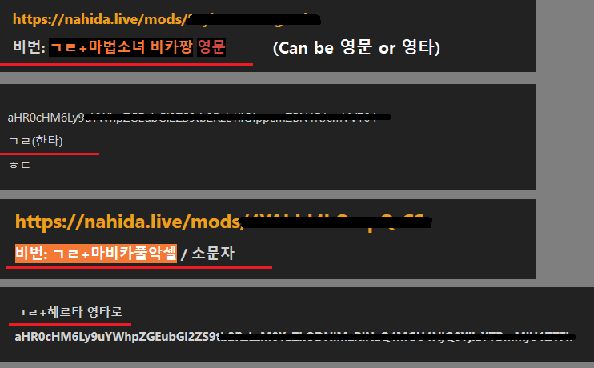  

- 한타 - Korean layout (it's called "Hanta")
- 영타 or 영문 - English layout

How this works: you type korean words using an english keyboard or vice versa  
(not translating, you are just “on wrong” keyboard. People who use multiple layouts might understand 😉)  

For a better understanding take a look on korean keyboard:

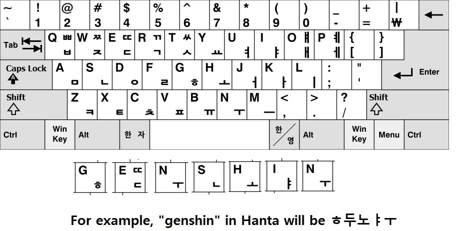

“ㅎ두노ㅑㅜ” is <ins>not a translation</ins> for “genshin”, it’s just random korean letters

❗There is a tool for converting egnlish keyboard to korean and vice versa:  
- Link: https://wepplication.github.io/tools/eng2Kor/

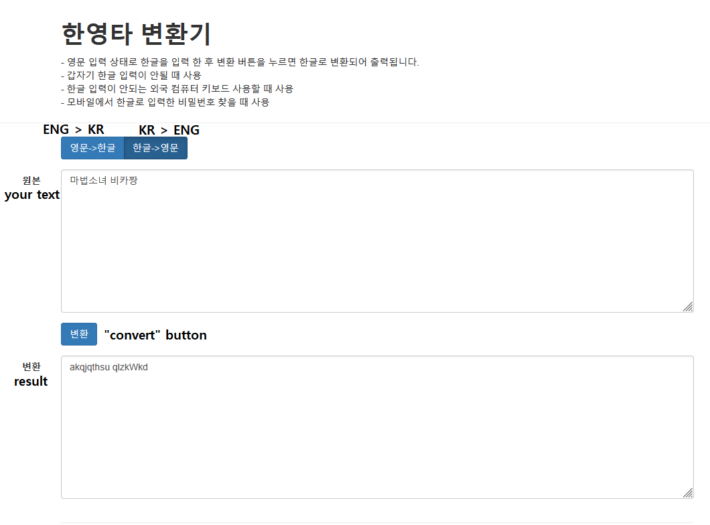  

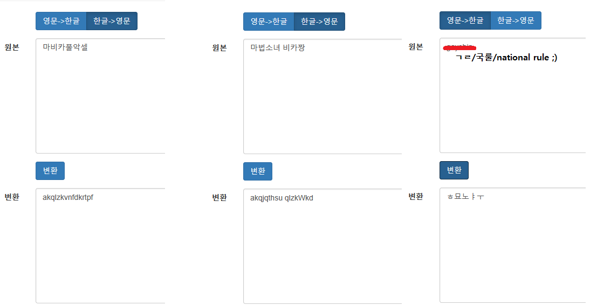  

### 4) Passwords with pictures  

Uploader uses random picture with text on it for their password which looks like something like this:

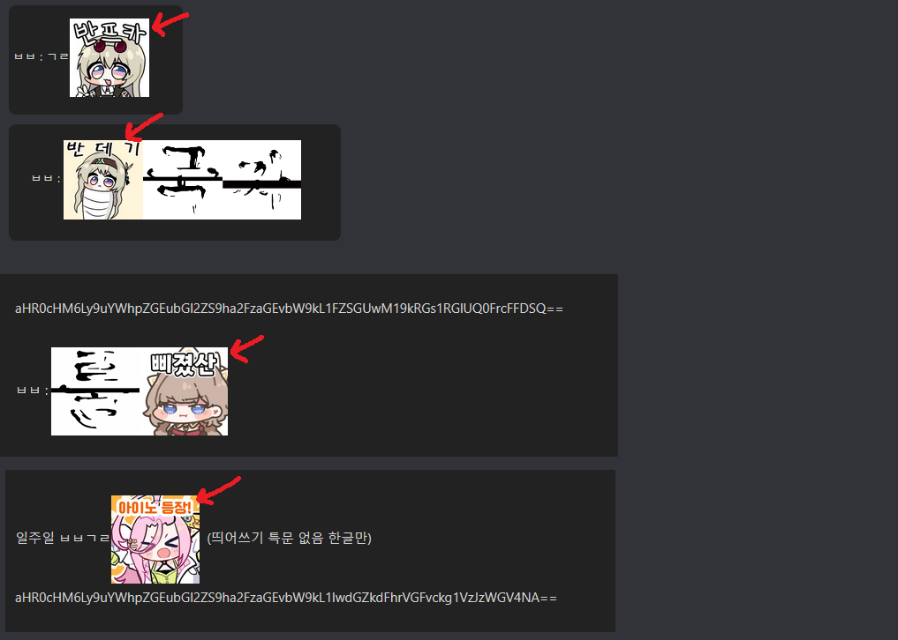  

These pictures are called 아카콘 or Arcacon (Arca+emoticon). You can try to translate text on them but most of the time you just have to add text from picture to password.  
❗This website can help you with text on those pictures:  
- https://kanji.reader.bz/korean/

Just draw what you see as accurate as you can and it will convert your drawing to an actual text. (examples shown below)  
_Note:_ if there are special characters in image's text, in 90% cases you should exclude them unless told otherwise.

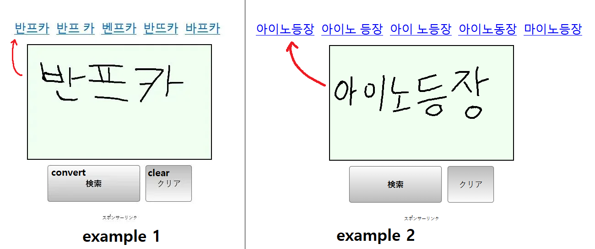  

Korean alphabet and syllables below for reference

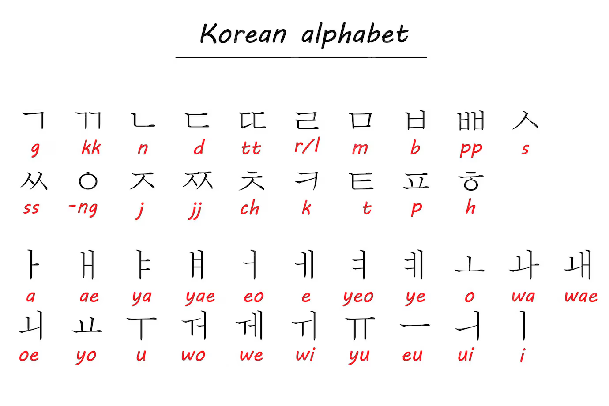  

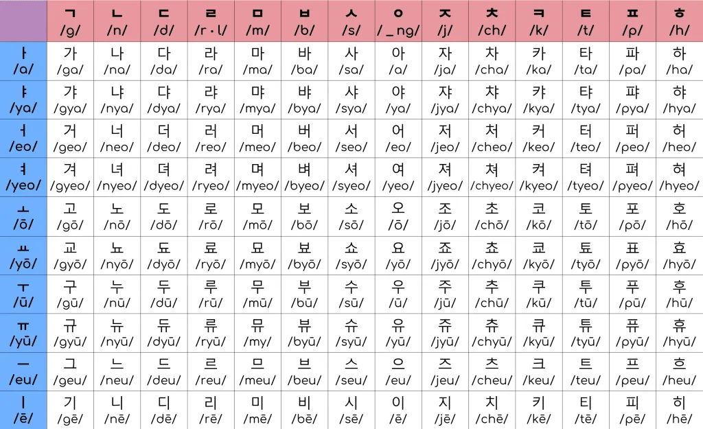  

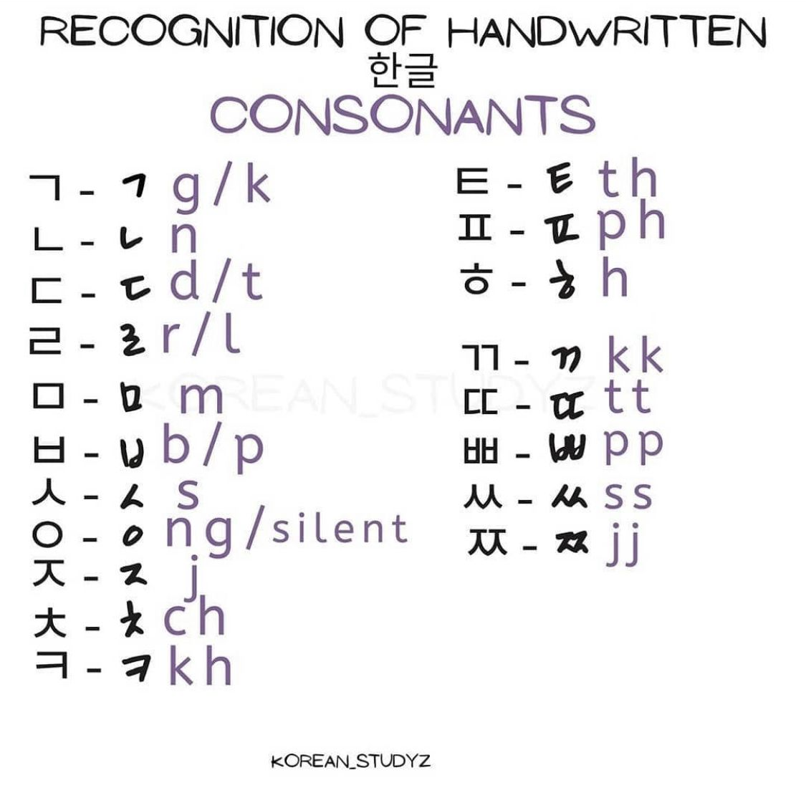  

On some pictures it's quite difficult to determine what symbols are there if you don’t know korean (especially if it's handwritten letters 🙁)  
You can ask someone else or try to learn hangul, it’s pretty simple tbh  
Also I can’t make a list with these pictures because there are hundreds of them and new ones uploaded almost everyday…

### 5) Words with its each symbol separated

This type of password appeared recently :v  
As the name says, uploader writes word which you have to add to N.Rule but each symbol is separated  

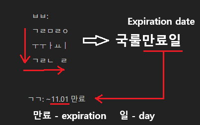  

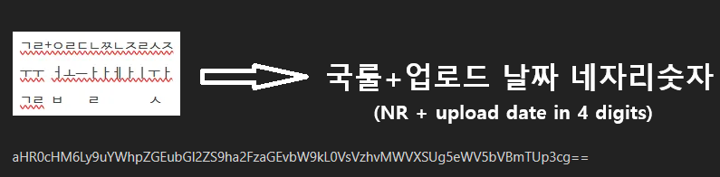  
In these two examples above if you kinda "squish" these symbols you can kinda can see the word.  

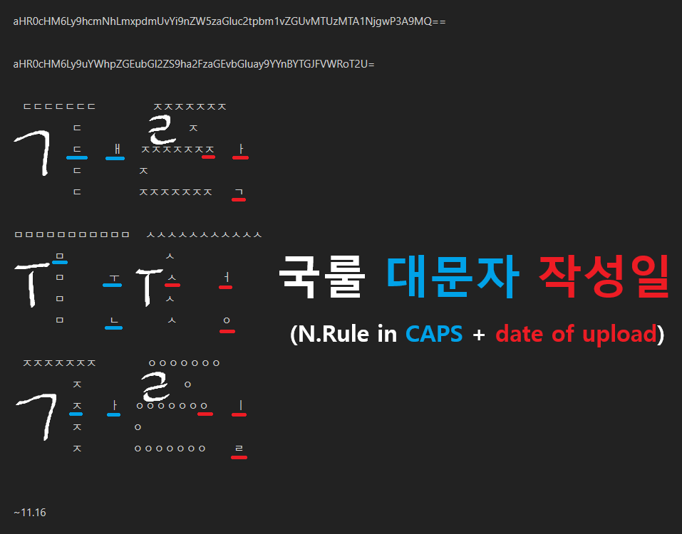  

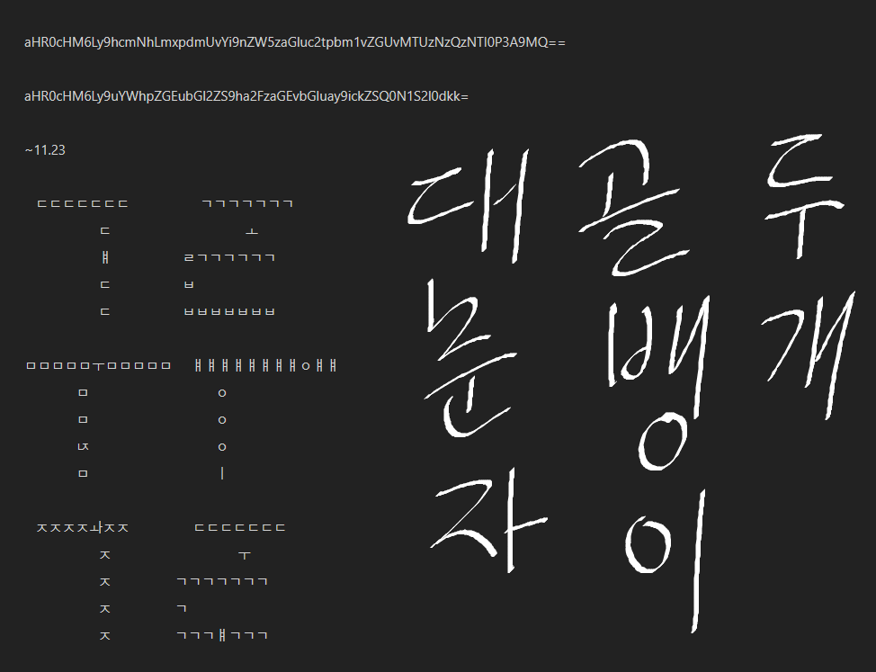

At this point I'm sorry but there is no way someone can solve it without knowing korean...  
Symbols itself arranged in the shape of "국룰" and those symbols make other words...  
And the last one is f#cked up because every character here is wrong and the result just _resembles_ the right word lmao  
But thank god that author of these puzzles is tired of making them so I hope it won't show up in the future lol  

### 6) Whatever uploader wanted. It can be literally anything 💀  

At this point just try to ask ChatGPT, do some extensive googling or ask someone else lol

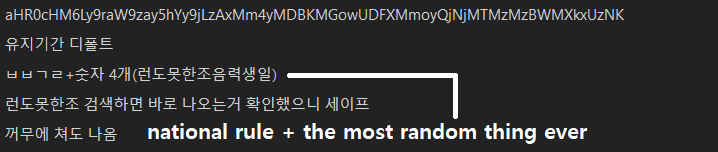  

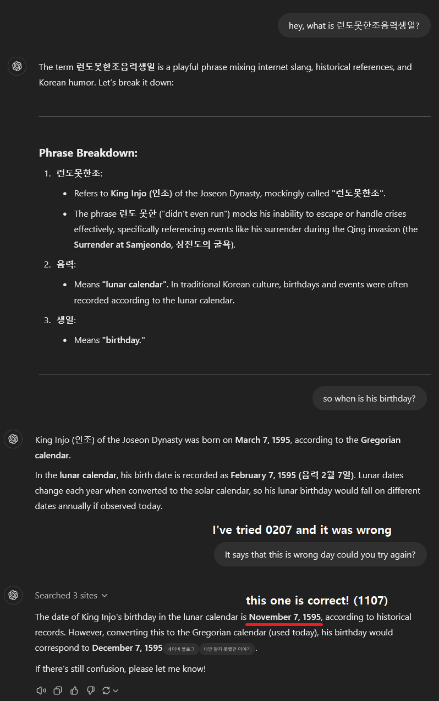

# I hope this will help you somehow. Good luck and have a nice day~
