Korean words list: [link](https://github.com/left-h4nded/Arcalive-guide/blob/main/korean%20words%20list.md) / Arcalive emoticons list: [link#1](https://imgur.com/a/arcalive-emoticons-list-5iPEi8C) [link#2](https://imgur.com/a/rip-eyes-lol-EjGQFGA)
# How to download korean mods from Arcalive
To respect the Korean community I won't share any arcalive links, passwords and mods itself.
This guide is made to help you get mods **yourself**. Koreans don't mind you downloading their mods as
long as you do it quietly and don't spam everywhere things like "password pls" and etc.

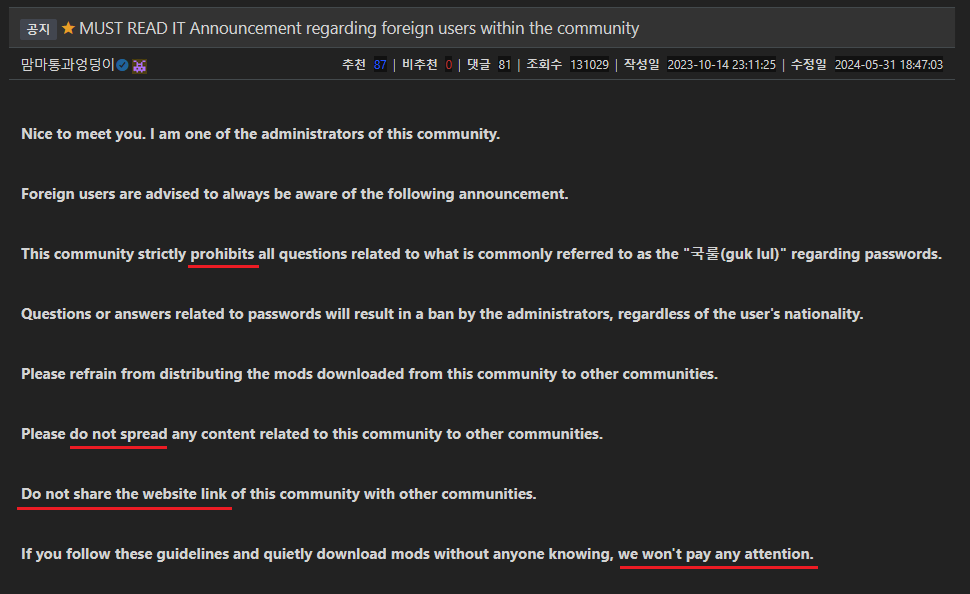

## 1) Main Page
This is what Arcalive looks like. You don't have to register unless you want NSFW mods.  

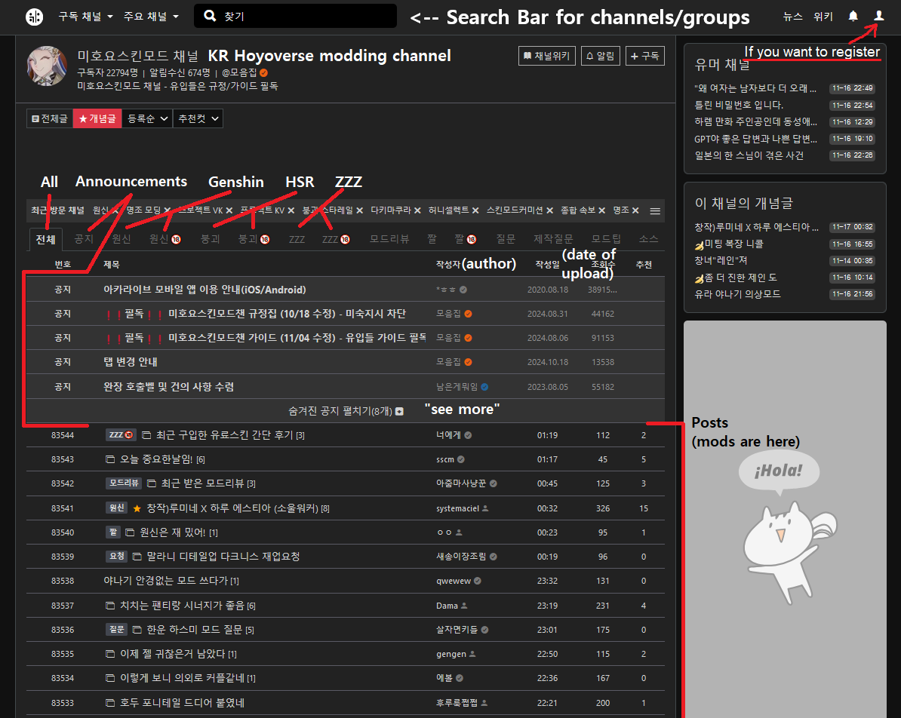  
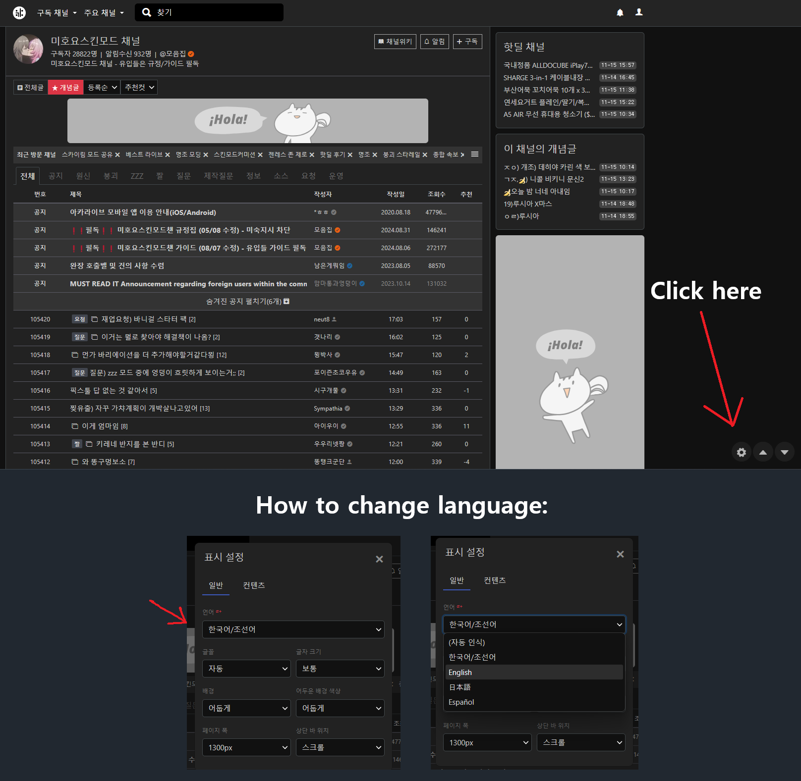
- Top Search Bar: you can find many groups for different games and stuff (basically it's korean Reddit lol)  
As for gacha games modding there are two main groups:
  - **미호요스킨모드 채널** - Genshin, HSR, ZZZ
  - **명조 모딩 채널** - Wuwa
- Bottom Search Bar: you can find posts and mods. There you can enter character or mod name.  
  Characters' names in korean:
  - Genshin: https://genshin-builds.com/ko/characters
  - HSR: https://genshin-builds.com/ko/hsr
  - ZZZ: https://genshin-builds.com/ko/zenless
  - Wuwa: https://genshin-builds.com/ko/wuthering-waves
   
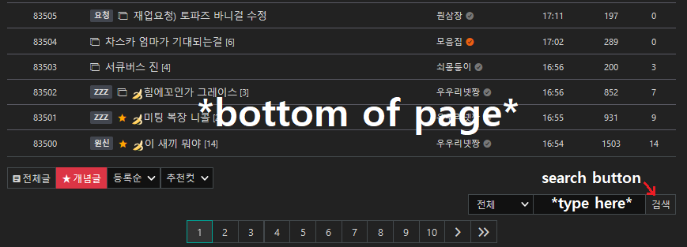

## 2) Mod Page 
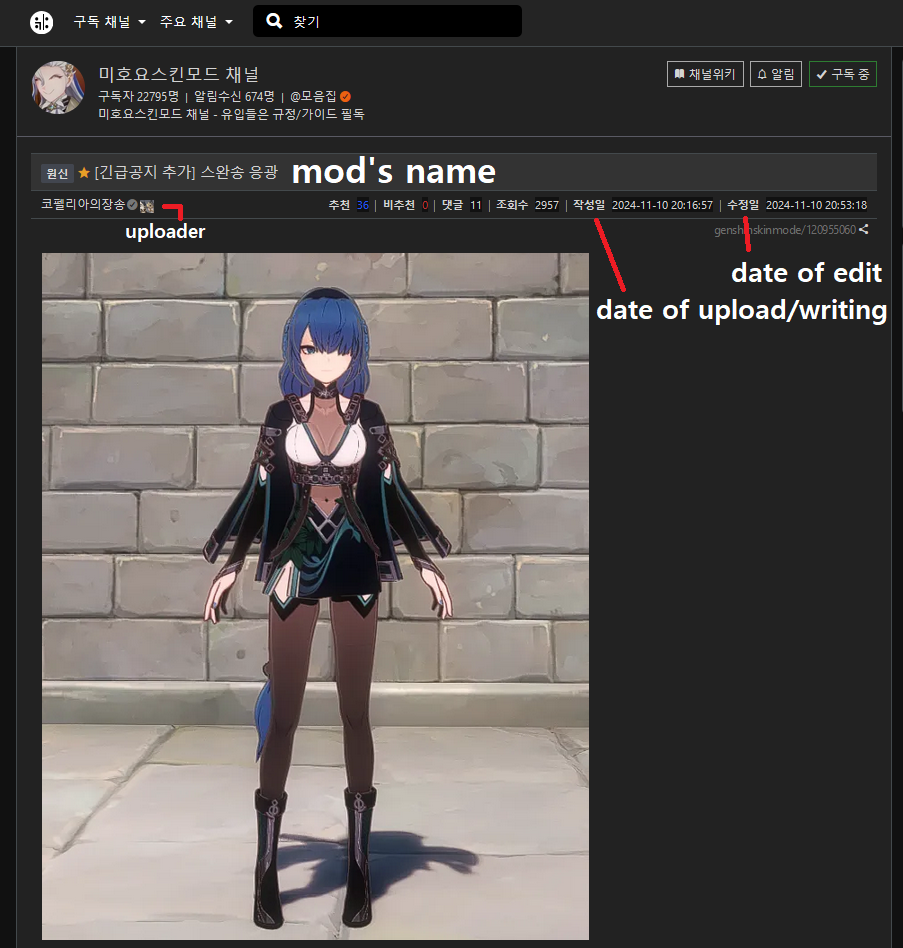  

In the post there will be a string of letters and numbers which you have to decode using  
[Base64 online decoder](https://www.base64decode.org/) (after decoding it will give you a link to download mod)  
**Note:** In rare cases, you may need to decode it more than once.

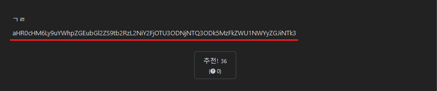  

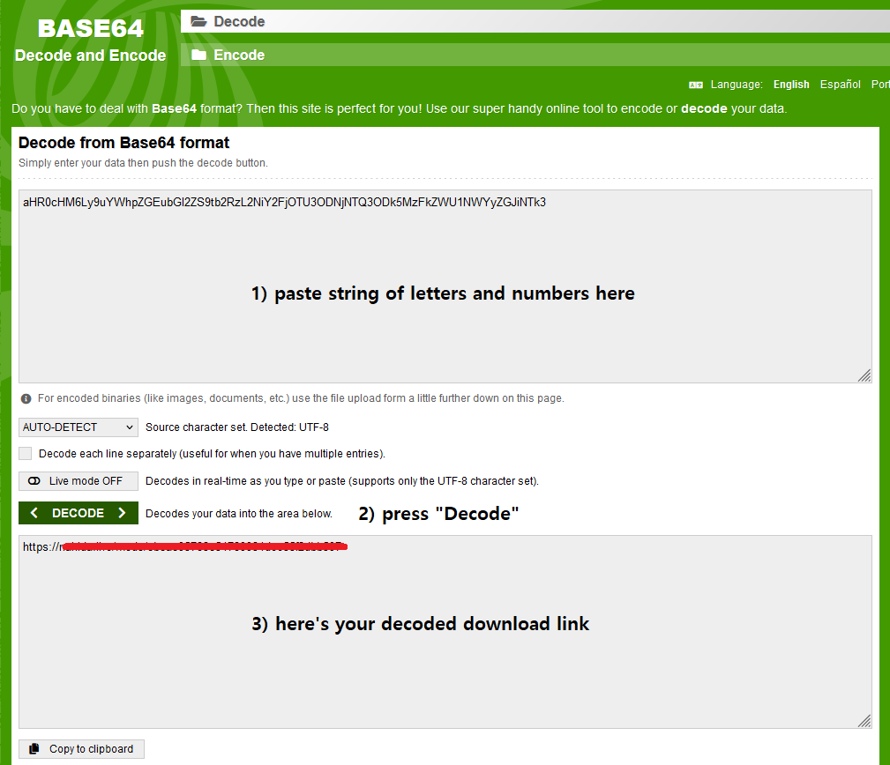  

Now you are on the mod download page (most likely Nahidalive or Kiosk)
To download it, you have to enter the password (sometimes there are mods without password)   

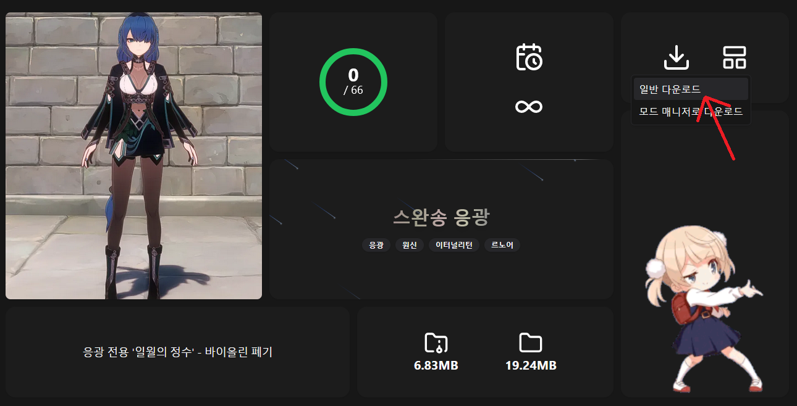
### Note:   
If the <ins>Kiosk</ins> link leads to homepage - it’s most likely expired since they usually last only one month.
(you can try to look for reuploads. Look for the recent posts with word 제업 or ㅈㅇ + mod name)  

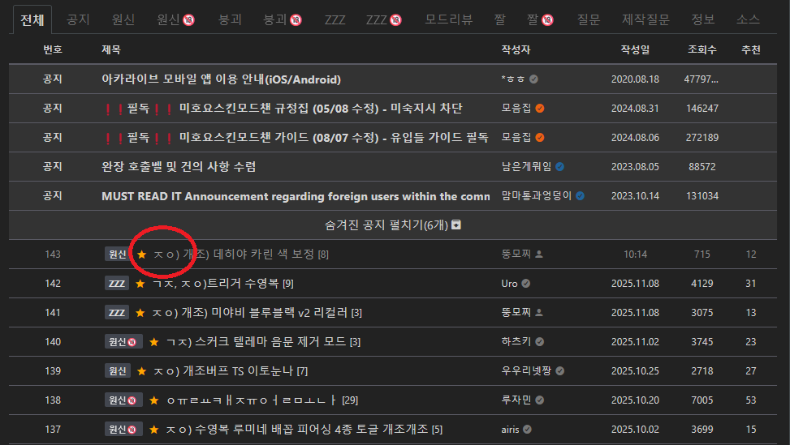  

## 3) Password  

So what the hell is “**국룰**” or “**ㄱㄹ**” (Also known as “_national rule_”)?  
It's korean slang and to put it simply, national rule is something obvious that everyone should know. In this case it’s the secret word that koreans know and instead of mentioning it they simply say “국룰”  

So how to find it? Click on **공지** then scroll down and look for **the post with title "국룰"**  

  

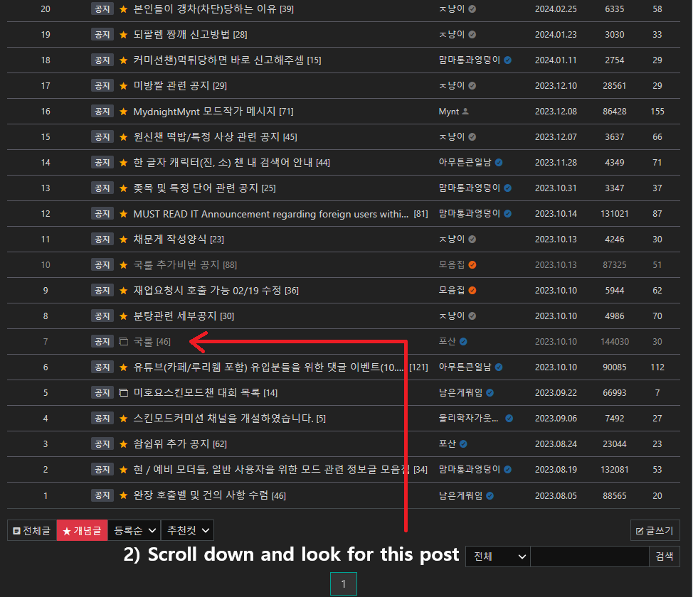  

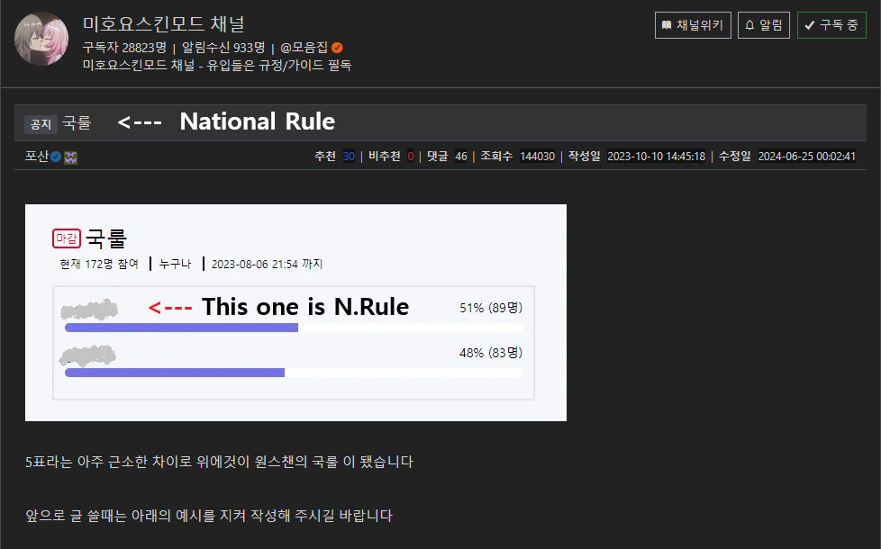

### Note: just in case, DO NOT ENTER 국룰 itself lol  

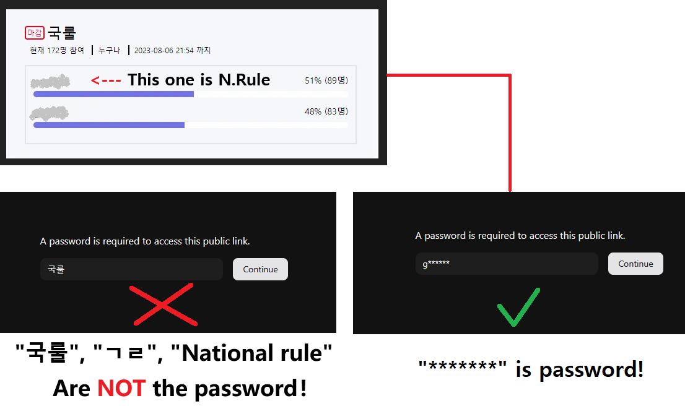  

### For Wuwa players:  

Unlike Hoyoverse modding community, Wuwa’s password is easily accessible:

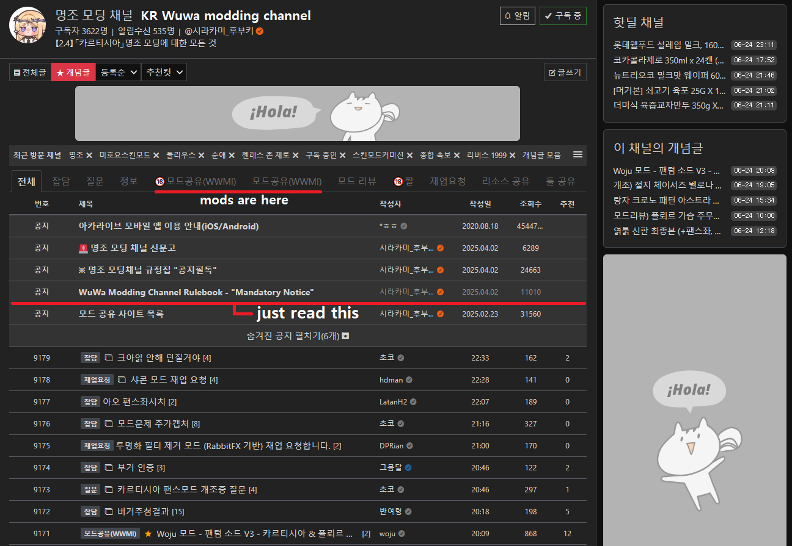

So… is “*******” = password for downloading all korean mods? Partially... Let me explain in the next section! :D

## Types Of Password

### 1) The most simple one and yeah, that's just national rule itself  

### 2) National rule + numbers or symbols
it can be:
- character's name/birthday/attribute/vision/path/whatever
- date of upload or any other date
- special characters (@,!,#,%,etc.)

There are so many variants so people who upload mods should clarify it as:  
national rule + something (this can be text, pictures, or a GIF, as shown below) 

Here are lists of pictures they attach to password that I've translated (These pictures are not used as often lately tho)

- List 1: https://imgur.com/a/arcalive-emoticons-list-5iPEi8C 
- List 2: https://imgur.com/a/rip-eyes-lol-EjGQFGA (these are very rare)

❗ https://pastebin.com/d4XFd1Ei - List with korean words you may encounter on Arca which is regularly updated.

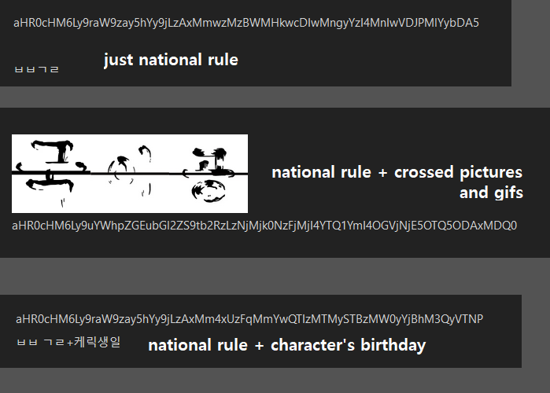

